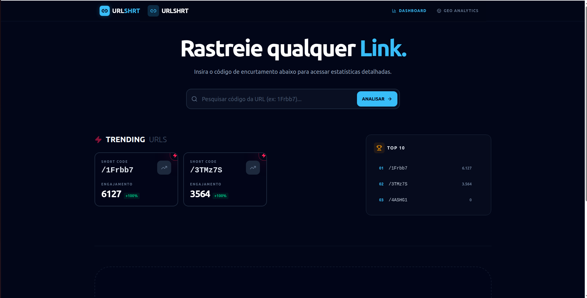
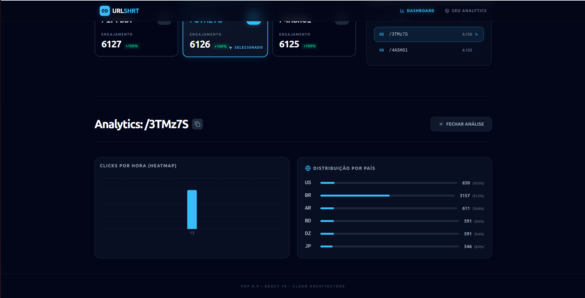
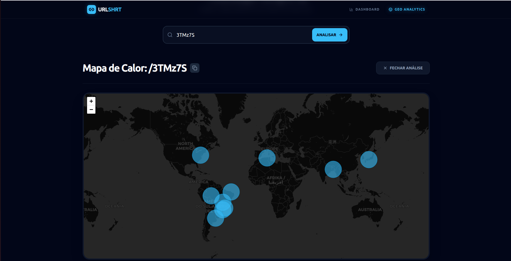
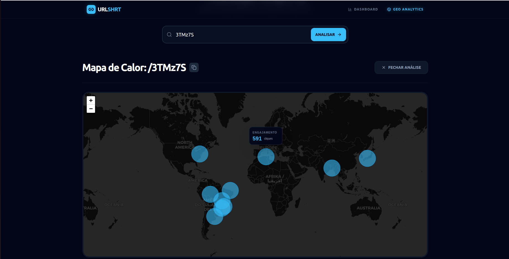

### **URLSHRT - Dashboard de Analytics**

---
# PT-BR

Um painel de alta performance para monitoramento de cliques e engajamento geográfico em tempo real, construído com foco em UI/UX polida e velocidade.
Precisa ser usado em conjunto com o Backend: https://github.com/SaorCampos/url_shortener

### **🚀 Tecnologias**
| Categoria | Tecnologia |
| :--- | :--- |
| **Framework** | React 19 + Vite |
| **Estilização** | Tailwind CSS 4 + Lucide React |
| **Gráficos** | Recharts |
| **Geolocalização** | React Leaflet (Heatmaps) |
| **Estado/API** | TanStack Query + Axios |
| **Infra** | Docker + Makefile |

---

### **🛠️ Setup do Projeto**

#### **Opção 1: Via Makefile (Recomendado)**
Se você já tem o Docker e o Make instalados, basta rodar o comando principal que já configura o ambiente:
```bash
make setup
```
**Acessar:** `http://localhost:3000`

#### **Opção 2: Manual (NPM)**
Caso queira rodar fora do container para desenvolvimento rápido:
1. Instale as dependências:
   ```bash
   npm install
   ```
2. Inicie o servidor de desenvolvimento:
   ```bash
   npm run dev
   ```

---

### **✨ Funcionalidades**
*   **Trending URLs**: Visualização de cards com as URLs mais acessadas, incluindo indicadores de viralização (`Zap`) e crescimento.
*   **Mapa de Calor Geográfico**: Visualização precisa de onde vêm os cliques usando o motor Leaflet com tooltips dinâmicos.
*   **Engajamento por Hora**: Gráfico de barras detalhando o comportamento dos usuários ao longo do dia.
*   **Distribuição por Países**: Ranking de tráfego segmentado por localização.
*   **Dark Mode Nativo**: Interface otimizada para baixo cansaço visual com elementos em *Glassmorphism*.

---

### **📸 Screenshots**

1. **Dashboard Geral**: - Visão geral dos cliques e tendências.
<p align="center"></p>
<p align="center"></p>

2. **Mapa de Calor**: Detalhe da distribuição geográfica dos acessos.
<p align="center"></p>
<p align="center"></p>
---
